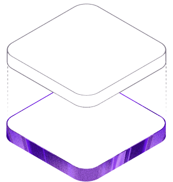

# Skylio — Minimalist Precision Weather Application

[](https://react.dev/)
[](https://www.typescriptlang.org/)
[](https://tailwindcss.com/)
[](https://open-meteo.com/)

A quiet, type-forward weather web application designed with an emphasis on typography, micro-animations, and visual clarity. Skylio eschews cluttered dashboard cards in favor of a signature dynamic **horizon line**—a subtle gradient that shifts hues based on the current weather condition and solar cycle.

---

## UI Preview



---

## Key Features

- **Dynamic Solar Horizon:** Real-time gradient indicator adapting between daytime gold-blues, twilight purples, and deep night indigos.
- **Precision Meteorological Telemetry:** Real-time temperature, hourly trend graphs, precipitation probability, humidity, UV index, and wind velocity.
- **Zero-Key API Integration:** Seamlessly retrieves weather and geocoding coordinates via the free, open-access **Open-Meteo API**.
- **Smooth Kinetic Physics:** High-frame-rate transitions and gestures powered by Framer Motion and Lenis smooth scrolling.

---

## Tech Stack

- **Framework:** React 19 + Vite
- **Language:** TypeScript
- **Styling:** Tailwind CSS v4
- **Animation & Motion:** Framer Motion, Lenis Scroll
- **Data Source:** Open-Meteo Weather & Geocoding APIs

---

## Getting Started

```bash
# Clone the repository
git clone https://github.com/mizan989/Skylio-Weather_App.git
cd Skylio-Weather_App

# Install dependencies
npm install

# Run the development server
npm run dev
```
Open [http://localhost:5173](http://localhost:5173) in your browser.
