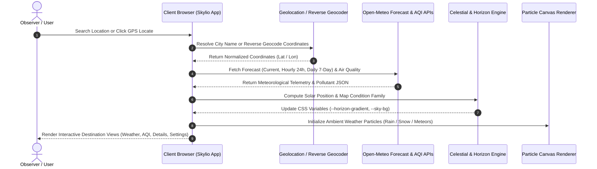

<p align="center">
  <a href="https://github.com/mizan989/Skylio-Weather_App">
    
  </a>
</p>

<div align="center">

# Skylio

### The minimalist precision atmospheric intelligence platform & celestial forecast engine. Real-time meteorological telemetry, dedicated Air Quality analytics, dynamic solar horizon gradients, particle atmospheric canvas, and fluid kinetic physics.

<br/>

<a href="#-quick-start"></a>
<a href="https://github.com/mizan989/Skylio-Weather_App"></a>
<a href="https://github.com/mizan989/Skylio-Weather_App/discussions"></a>

<a href="#-ways-to-run-skylio"></a>
<a href="https://github.com/mizan989/Skylio-Weather_App"></a>

<a href="https://github.com/mizan989/Skylio-Weather_App/stargazers"></a>
<a href="LICENSE"></a>
<a href="https://react.dev"></a>
<a href="https://www.typescriptlang.org"></a>
<a href="https://tailwindcss.com"></a>
<a href="https://open-meteo.com"></a>
<a href="https://framer.com/motion"></a>

</div>

> [!TIP]
> **Precision Atmospheric Instrument!** Experience real-time meteorological calculations, dedicated Air Quality analytics (EAQI & US EPA AQI), dynamic diurnal horizon gradients, interactive 24-hour hourly trend analytics, and high-precision telemetry matrices — [Get started locally in under 60 seconds](#-quick-start).

---

## Skylio Overview

Skylio is an open-source, minimalist precision weather application and celestial telemetry engine. Engineered to replace cluttered, ad-heavy meteorological dashboards with typographic elegance and scientific clarity, Skylio presents weather as a quiet, atmospheric discipline: real-time meteorological metrics, 24-hour barometric trends, dedicated Air Quality analytics, and a signature dynamic **horizon line**—a hairline gradient that shifts chromatic hues in real time according to local solar elevation and WMO weather condition families.

Operating on a direct, client-to-API zero-key architecture powered by **Open-Meteo**, Skylio queries high-resolution global numerical weather prediction models (including ECMWF, GFS, and DWD ICON) and dedicated atmospheric chemistry models. All coordinates, search history, pinned locations, and measurement preferences are handled directly in volatile browser memory and persisted privately in client `localStorage`—guaranteeing complete user privacy with zero tracking, zero telemetry logging, and zero third-party cookies.

**Key Capabilities:**

- **Zero-Key Open Meteorological Architecture** — Direct, unencumbered client queries to high-resolution ECMWF and GFS numerical models via Open-Meteo Forecast and Air Quality REST endpoints
- **Four Dedicated Primary Destinations** — Deeply structured views for Weather, Air Quality, Telemetry Details, and Preferences
- **Dedicated Air Quality Analytics** — Dual-standard Air Quality Index (European EAQI & US EPA AQI), 6 key pollutants ($\text{PM}_{2.5}$, $\text{PM}_{10}$, $\text{O}_3$, $\text{NO}_2$, $\text{SO}_2$, $\text{CO}$ in $\mu\text{g/m}^3$), 24-hour diurnal trend charts, and actionable health guidance
- **Dynamic Diurnal Horizon Engine** — Signature hairline gradient dynamically computing ambient solar elevations and chromatic shifts between daylight gold-blues, twilight purples, and deep nocturnal indigos
- **Reactive 2D Particle Canvas** — Hardware-accelerated canvas particle simulation rendering adaptive atmospheric phenomena (rain streaks, snow drift, cloud fog, and celestial meteors)
- **High-Precision Local Typography** — Clean system font stack with tabular numerics (`font-variant-numeric: tabular-nums`) and zero remote static CDN dependencies
- **24-Hour & 7-Day Synoptic Matrices** — Interactive hourly SVG spline curve scrubber paired with 7-day temperature spreads, gradient range bars, and expandable daily detail drawers
- **Privacy-First Zero-Tracking Design** — No user registration, no telemetry tracking, and zero advertising cookies; coordinates and bookmarks stay strictly in browser `localStorage`
- **Responsive Dual Navigation** — Desktop top navigation bar paired with an ergonomic mobile docked bottom navigation bar

<br>

<div align="center">
  <pre>
┌─────────────────────────────────────────────────────────────────────────────────┐
│                                     SKYLIO                                      │
│      Location Query ➔ Reverse Geocode ➔ Open-Meteo ➔ Celestial Physics UI      │
├───────────────────────────────┬─────────────────────────────────────────────────┤
│  🌍 Atmospheric Data Engine   │  ✨ Dynamic Diurnal Horizon                     │
│   • Open-Meteo REST telemetry │    [Chromatic Elevation State]                  │
│   • ECMWF, GFS & AQI blends   │       ├── Diurnal Solar Cycle (Dawn/Dusk/Night) │
│   • WMO Weather Code parsing  │       ├── Condition-Reactive Gradient Hues      │
├───────────────────────────────┼─────────────────────────────────────────────────┤
│  📊 Microclimate Telemetry    │  ⚡ Fluid Kinetic Presentation                  │
│   • 24h Hourly Trend Curves   │    • Framer Motion Spring Transitions           │
│   • 7-Day Synoptic Matrix     │    • Lenis Smooth Inertial Scrolling            │
│   • EAQI & US EPA AQI Grid    │    • Canvas Particle Atmospheric Canvas         │
└───────────────────────────────┴─────────────────────────────────────────────────┘
  </pre>
</div>

---

## UI Preview

<p align="center">
  
</p>

---

## Meteorological Sequence Flow



---

## Use Cases

- **Hyperlocal Daily Decision-Making** — Instant real-time temperature, "feels-like" thermal comfort index, and data-derived weather summaries
- **Environmental & Air Quality Health** — Monitor particulate matter ($\text{PM}_{2.5}$, $\text{PM}_{10}$) and toxic gases with EAQI and US EPA indexes for outdoor activity planning
- **Hourly Activity & Travel Planning** — Interactive 24-hour temperature and precipitation curves to pinpoint optimal weather windows
- **Weekly Synoptic Planning** — 7-day multi-day outlook showing daytime highs, overnight lows, and expandable meteorological drawers
- **Extreme Weather & UV Protection** — Real-time UV Index rating (0–11+) and peak sun protection advisory
- **Celestial & Diurnal Monitoring** — Sunrise and sunset timestamps, daylight duration, and day/night celestial transitions
- **Offline & Private Bookmarking** — Fast switching between favorite global cities stored securely in local browser storage

---

## 🚀 Quick Start

**Prerequisites:**
- Node.js 18.x or higher
- Modern web browser with Canvas 2D and CSS custom properties support

### Installation & First Run

```bash
# 1. Clone the repository
git clone https://github.com/mizan989/Skylio-Weather_App.git
cd Skylio-Weather_App

# 2. Install dependencies
npm install

# 3. Start development server
npm run dev
```

Open **[http://localhost:5173](http://localhost:5173)** in your browser to start exploring Skylio.

> [!NOTE]
> **Zero API Keys Required!** Skylio communicates directly with Open-Meteo's open-access meteorological API. You do not need to register developer accounts, sign up for API tokens, or configure billing keys to run the application locally or in production.

---

## Ways to Run Skylio

- **Local Modern Dev Server** — Instant startup and ultra-fast hot module replacement (HMR) powered by Vite 8. [Quick Start](#-quick-start)
- **Production Self-Hosted Bundle** — Compile the client into optimized static assets (`npm run build`) and serve via Nginx, Caddy, Vercel, or GitHub Pages.
- **Preview Staging Instance** — Test production-bundled output locally using `npm run preview`.

---

## ☁️ Atmospheric Destinations & Views

Skylio delivers 4 purpose-built primary destinations tailored for atmospheric analysis:

### 1. Weather Destination (`/weather`)
- **Luxury Atmospheric Hero Card** — Displays current temperature with tabular typography, local timezone clock, high/low spread, feels-like temperature, and a deterministic summary badge (e.g., *"Clear skies through afternoon; breezy gusts"*).
- **24-Hour Forecast Timeline** — 24-hour forecast timeline with dual view modes (smooth interactive SVG spline curve with scrubber vs. horizontal card carousel), synchronized with the location's actual timezone.
- **Today's Highlights** — Today's 4 core metrics: Relative Humidity & Dew point, Wind & Gusts with Cardinal Direction, UV Index with Exposure Scale, and Solar Diurnal arc with daylight duration.
- **7-Day Forecast Matrix** — Multi-day synoptic outlook featuring gradient temperature range bars and expandable accordion drawers revealing daily precipitation probability, wind speed, UV max, and sunrise/sunset times.

### 2. Air Quality Destination (`/air-quality`)
- **Dual Index Standards** — Toggle between **US EPA AQI** (0–500 scale) and **European EAQI** (1–5 scale).
- **6 Key Pollutants** — Dedicated pollutant cards for $\text{PM}_{2.5}$, $\text{PM}_{10}$, $\text{O}_3$, $\text{NO}_2$, $\text{SO}_2$, and $\text{CO}$ in $\mu\text{g/m}^3$ alongside condition status badges.
- **24-Hour Diurnal Trend** — Hourly pollutant trajectory bar chart tracking air quality shifts throughout the diurnal cycle.
- **Plain-Language Health Guidance** — Actionable advisories for sensitive groups, outdoor exercise, home ventilation, and protective mask recommendations.

### 3. Details Destination (`/details`)
- **Advanced Telemetry Grid** — Categorized meteorological observations with interactive category filter pills (`All`, `Atmosphere`, `Wind`, `Solar`, `Hydrology`).
- **Granular Metrics** — Mean Sea Level pressure, surface pressure, dew point, cloud cover, visibility distance, wind gusts, cardinal compass degrees, Beaufort scale rating, UV index, sunrise/sunset, daylight duration, precipitation accumulation, and rain probability.

### 4. Settings Destination (`/settings`)
- **Measurement Preferences** — Functional preference switching persisted to browser `localStorage`:
  - **Temperature:** Celsius (°C) / Fahrenheit (°F)
  - **Wind Speed:** Kilometers per hour (km/h) / Miles per hour (mph) / Meters per second (m/s)
  - **Precipitation:** Millimeters (mm) / Inches (in)
  - **Time Format:** 12-Hour (AM/PM) / 24-Hour
- **Location Troubleshooting** — Built-in permissions guide for browser geolocation.
- **Data Attribution** — Transparent links and acknowledgements to Open-Meteo.
- **Legal Governance** — Direct launch modal for the Privacy Policy and Terms of Service.

---

## ✨ Design & Architecture Principles

### Zero-Remote Static Asset Policy
Skylio strictly complies with a zero-remote static asset standard:
- **No Remote Fonts:** Removed all external Google Fonts CDN links. The interface renders using high-performance local system font stacks with tabular numerals (`font-variant-numeric: tabular-nums`).
- **No Remote Icons:** All icons are bundled locally via `lucide-react`.
- **Local Brand Assets:** All favicons and application marks are generated and served locally from `public/`.

### Dynamic Diurnal Horizon Engine
Skylio dynamically shifts its atmospheric color palette and horizon hairline according to the current solar position and weather conditions:

```text
Local Solar Angle & WMO Code
         │
         ▼
[1. Condition Mapping]    ── Resolves Clear, Cloudy, Rain, Snow, or Storm
         │
         ▼
[2. Diurnal Calculation]  ── Interrogates is_day (Day vs. Twilight vs. Night)
         │
         ▼
[3. Chromatic Shift]      ── Injects --horizon-gradient and --sky-bg CSS vars
         │
         ▼
[4. Particle Simulation]  ── Activates Rain, Snow, Cloud Fog, or Meteors Canvas
```

### Modern Frontend Tech Stack

| Layer | Technologies |
|---|---|
| **Frontend Framework** | React 19, TypeScript, Vite 8 |
| **Styling & Design System** | Tailwind CSS v4, CSS Custom Properties (`--horizon-gradient`, `--sky-bg`) |
| **Animation & Kinetics** | Framer Motion, Lenis Smooth Inertial Wheel Scroll |
| **Iconography & Graphics** | Lucide React, Inline Meteorological SVGs |
| **Meteorological APIs** | Open-Meteo Weather Forecast API, Open-Meteo Air Quality API, Geocoding API |
| **Typography System** | System Sans & Monospace with Tabular Numerics (`tabular-nums` / `tnum`) — Zero CDN dependencies |
| **State & Local Persistence** | React Hooks, Browser `localStorage` |
| **Linting & Code Quality** | Oxlint, TypeScript strict mode |

---

## ⚙️ Configuration & Storage

### Unit Switching & Preferences

Skylio automatically persists temperature and measurement preferences in browser `localStorage`:

- **Metric System:** Temperature in Celsius (°C), Wind Velocity in km/h, Precipitation in millimeters (mm)
- **Imperial System:** Temperature in Fahrenheit (°F), Wind Velocity in mph, Precipitation in inches (in)

### LocalStorage Storage Keys

| Key | Description | Default Fallback |
|---|---|---|
| `skylio_preferences` | User unit preferences (temp, wind, precip, time format) | Metric defaults |
| `skylio-current-location` | Currently selected city coordinates and metadata | Kolkata, West Bengal, India |
| `skylio-bookmarks` | JSON array of saved favorite global cities | Preset global capitals |

### Default Meteorological Coordinates

If geolocation access is disabled or unavailable, Skylio gracefully falls back to:
```typescript
const DEFAULT_LOCATION: WeatherLocation = {
  name: 'Kolkata',
  admin1: 'West Bengal',
  country: 'India',
  latitude: 22.5726,
  longitude: 88.3639,
};
```

---

## Privacy & Data Governance Charter

Skylio was built from the ground up to respect user privacy:

- **Zero Tracking Scripts** — No Google Analytics, no Facebook Pixels, and zero user-tracking scripts.
- **No Mandatory Accounts** — Use all features, pin locations, and toggle units without creating an account or providing email addresses.
- **Client-Side Storage Only** — Pinned locations, units, and coordinates remain strictly stored on your own device via `localStorage`.
- **Encrypted Transmission** — All queries to Open-Meteo are transmitted via secure HTTPS (TLS 1.3).

---

## Architecture & Code Structure

```text
skylio/
├── assets/
│   └── screenshot.png          # High-resolution application preview screenshot
├── public/
│   ├── favicon.png             # 192x192 brand logo & favicon
│   ├── favicon-32x32.png       # 32x32 standard browser favicon
│   ├── logo.png                # High-resolution brand squircle icon (1141x1141)
│   └── logo-512.png            # 512x512 high-DPI icon
├── src/
│   ├── components/
│   │   ├── legal/              # LegalModal, PrivacyPolicy, TermsConditions
│   │   ├── AirQualityView.tsx  # Dedicated Open-Meteo Air Quality (EAQI & US AQI)
│   │   ├── DailyList.tsx       # 7-day synoptic forecast matrix with expandable drawers
│   │   ├── DetailsView.tsx     # Atmospheric, wind, solar & precipitation telemetry
│   │   ├── Footer.tsx          # Clean restrained footer & governance dock
│   │   ├── Header.tsx          # Brand logo, location chip, unit toggles & desktop nav
│   │   ├── HeroWeatherCard.tsx # Truthful atmospheric hero & deterministic summary
│   │   ├── HighlightsPanel.tsx # Compact essential observations panel
│   │   ├── HourlyChart.tsx     # 24-hour timezone-aligned trend graph & cards
│   │   ├── MobileNav.tsx       # Docked mobile bottom navigation bar
│   │   ├── SavedLocations.tsx  # Pinned city bookmarks bar
│   │   ├── SearchBar.tsx       # Debounced geocoding search & GPS locator
│   │   ├── SettingsView.tsx    # Functional unit preferences & attribution
│   │   ├── WeatherBackground.tsx # Reactive 2D canvas weather particle engine
│   │   └── inspira/
│   │       └── Meteors.tsx     # Lightweight celestial night meteors effect
│   ├── hooks/
│   │   ├── useAirQuality.ts    # Open-Meteo Air Quality API synchronization hook
│   │   ├── useGeolocation.ts   # Browser navigator.geolocation & reverse geocoding
│   │   ├── usePreferences.ts   # LocalStorage measurement preferences hook
│   │   └── useWeather.ts       # Open-Meteo Weather Forecast API synchronization hook
│   ├── lib/
│   │   ├── api.ts              # Open-Meteo REST endpoints & payload transformers
│   │   ├── horizon.ts          # Condition-to-gradient & diurnal solar color mapping
│   │   ├── time.ts             # Timezone-aware timestamping & diurnal calculations
│   │   ├── utils.ts            # Class merging utility (clsx + tailwind-merge)
│   │   ├── weatherCodes.ts     # WMO weather code mapping to conditions & icons
│   │   └── weatherSummary.ts   # Deterministic data-derived weather insight engine
│   ├── types/
│   │   └── weather.ts          # TypeScript interfaces for meteorological telemetry
│   ├── App.tsx                 # Root application orchestration & destination routing
│   ├── index.css               # Design tokens, typography & CSS variables
│   └── main.tsx                # React 19 root bootstrap & Lenis smooth scroll
├── index.html                  # HTML5 entry with local icon assets & viewport metadata
├── package.json                # Project dependencies and script declarations
├── tsconfig.json               # TypeScript compiler configuration
└── vite.config.ts              # Vite 8 build & bundler configuration
```

---

## ☁️ Cloud Deployment

Deploy Skylio to your preferred static hosting platform with zero server dependencies:

### Vercel
```bash
npm i -g vercel
vercel
```

### Netlify
```bash
npm i -g netlify-cli
netlify deploy --prod --dir=dist
```

### Static Web Servers (Nginx / Caddy / Docker)
Build the production bundle and serve the `dist/` directory:
```bash
npm run build
```

---

## Verification & Quality Bar

```bash
# Typecheck TypeScript codebase and generate production bundle
npm run build

# Run Oxlint linter on source code
npm run lint
```

---

## Contributing

We welcome contributions to Skylio! Whether you're optimizing Canvas particle physics, improving accessibility, or refining meteorological telemetry readouts:

1. Fork the repository
2. Create your feature branch (`git checkout -b feature/air-quality-pollutant-chart`)
3. Commit your changes (`git commit -m 'Add air quality pollutant chart'`)
4. Push to the branch (`git push origin feature/air-quality-pollutant-chart`)
5. Open a [Pull Request](https://github.com/mizan989/Skylio-Weather_App/pulls)

---

## Support the Project

**Enjoying Skylio?** Give us a ⭐ on [GitHub](https://github.com/mizan989/Skylio-Weather_App) to help spread open-source atmospheric intelligence!

---

## Acknowledgements

Skylio is built with gratitude towards the open-source meteorological and developer ecosystem:

- [Open-Meteo](https://open-meteo.com/) — Free, open-access meteorological weather forecast, air quality & geocoding APIs
- [React](https://react.dev/) & [Vite](https://vitejs.dev/) — Lightning-fast frontend tooling and runtime
- [Tailwind CSS](https://tailwindcss.com/) — Utility-first aesthetic styling engine
- [Framer Motion](https://framer.com/motion/) — Fluid spring animations and interactive layout transitions
- [Lenis](https://lenis.darkroom.engineering/) — Smooth momentum-based inertial scrolling
- [Lucide Icons](https://lucide.dev/) — Clean, consistent UI iconography

<div align="center">

> [!NOTE]
> **Meteorological Data Advisory:** Skylio delivers atmospheric telemetry for informational and personal convenience. While backed by world-class numerical weather prediction models (ECMWF, GFS, ICON), it is not certified for aviation flight planning, maritime navigation, or life-safety emergency defense. Always consult official national meteorological agencies (NOAA, Met Office, DWD, IMD) for certified severe weather warnings and directives.

</div>
